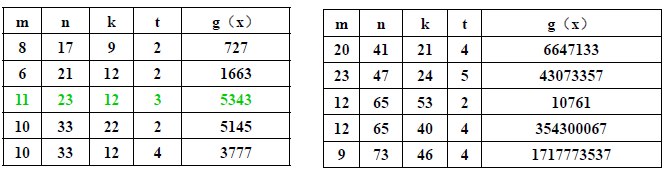
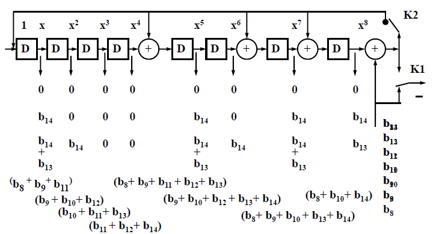

# 线性分组码

**基本原理**：

* 在线性分组码中，信息码元与监督码元通过线性方程联系起来。
* 许用码组称为群码。
* 群码中线性方程的运算法则是以模2和为基础。
* 如果有r个监督码元，就有r个监督方程式和r个相应的校验字，可给出$2^r$种状态。其中,$2^{r}-1$种状态可指明$2^{r}-1$个误码位置。
* (n，k）线性分组码中，$2^{r}-1 \geq n$，可以构建出能纠正一位或一位以上误码的线性码。其中$k$为信息码元个数，$r=n-k$为监督码元长度，$n$为码元个数。

## 循环码

### 性质

* n个码元的码组中**k个信息码元在前，r个监督码元在后**。
* **封闭性**-码组中任意两个码字模2和是许用码组
* **循环性**-循环移位后也是许用码组

核心，做除法，模2取余。

### 三个定理

* 在循环码中，若$T(x)$是一个长度为n的许用码组，则$x^iT(x)$在按模$x^{n+1}$运算下也是一个许用码组。(实际上乘以$x^i$相当于循环左移i次)
* 在一个(n，k）循环码中，有唯一的一个r = n - k次多项式$g(x)$使得：
  * 它是次数最低的非零多项式。
  * 每个码元多项式都能被$g(x)$整除。
* (n，k）循环码生成多项式$g(x)$是$x^n+1$的一个因式。
  * 所以可以使用对$x^n+1$进行因式分解的方法寻找$g(x)$

循环码的三个定理表明，只要找到生成多项式g(x)，就可以得到一组可用循环码。而可以对$x^n+1$进行因式分解的方法寻找$g(x)$。

> 如要寻找(7,3)循环码的生成多项式，首先r=7-3=4，要找一个$x^7+1$的四阶因式。
>
> $x^7+1 =(x+1)(x^3+x^2+1)(x^3+x+1)$
>
> 那么如果使用$(x+1)(x^3+x^2+1)$组合，则$g(x)=x^4+x^2+x+1$
>
> 如果使用$(x+1)(x^3+x+1)$组合，则$g(x)=x^4+x^3+x^2+1$

### 循环码的编解码方法

#### 编码

* 根据给定的(n，k）值选定生成多项式$g(x）$，从$x^n+1$的因式中选出一个n-k次多项式作为$g(x）$；
* $m（x）$为信息码元多项式，其次数小于k；
* 用$x^{n-k}$乘$m（x$），得到$x^{n-k}m（x$），次数小于n；(即左移监督码元次。)
* 用$g（x）$除$x^{n-k}m（x)$，得到余式$r（x）$，次数小于n-k；
* 将余式$r（x）$与$x^{n-k}m（x）$相加，得到编码成的码组。

**编码电路**：

初始状态四个D触发器均为0000

首先看第一个1进去，与触发器上一个状态的0相加，为1，然后这个1就被送到$1，x，x^2$处。

第一个触发器变为为1，第二个触发器为第一个触发器的0+送过来的1=1，第三个为0+1=1，第四个0+0=0，结果为1110。

第二个1送进来，与第四个触发器的0相加，为1，送到$1，x,x^2$处。

第一个触发器为1，第二个触发器为1+1=0，第三个为1+1=0，第四个1结果为1001。

第三个0进去，与第四个触发器上一个状态1相加，为1，送到$1，x，x^2$处。

第一个触发器变为1，第二个触发器为上一个的1+送来的 1=0，第三个触发器为上衣额的0+送来的1=1，第四个触发器等于0，最终结果为1010。

#### 解码

* 接收码组与生成多项式项除，用余项是否为零来判别码组中有无误码；

* 可纠正的错误码组构成样式与特定余式相互对应。

  

**纠错步骤**

* 生成多项式g(x)除接收码组R(x)得商和余式；
* 根据余式查表或运算得到差错值E(x)；
* 从R(x)中减掉E(x)，得到正确得原始码组T(x)；

如原来的信号为T(x),传输过程中为R(x),出发得到余数，查表得到，第一位错误。所以减去错误，即可得到原来的信号。

### 分类

#### BCH码

循环码的一种，有纠多位随机误码的能力；$g（x）$与$d_0$有明确的关系，容易构造纠正t个错误的BCH码。

##### 分类

本原BCH码：码长为$2^m-1$

​	

​	n为码长，m为最每个因式的最高次幂，k为信息位长，t为纠错个数。

​	g(x)看法：用八进制写出来，然后写成多项式形式。如以13为例，写成八进制001011，那么$g(x)=x^3+x+1$

非本原BCH码：码长为$2^m-1$的因子

​	

**码长，监督码元n-k与纠错数t的关系为**：

对于任何一个正整数m和小于m/2的纠错数t，存在一种码长$n= 2^m-1$，监督码元数$n-k≤mt$构成的BCH码，可纠正小于等于t个随机误码。即$2^m-1-k \leq mt$。

##### BCH的生成多项式

$g(x) = LCM[m_1(x),m_3(x), … ,m_{2t-1}(x)]$ ,一共t各因式，每个因式最高次幂m，$r=n-k\leq mt$。

一般而言，**能分解成几个因式，就能纠正几个错误**。

##### 编码

##### 纠错

* 用g（x）的各因式对接收的码组多项式求余式，得到t个余式。
* 对t个余式通过误码位置计算电路构造出特定的误码多项式，以误码位置作为多项式的根；
* 求解误码多项式，得到误码位置；
* 纠正存在的误码；

如

那么有两个电路：

#### RS码

非二进制的BCH纠错码;在(n, k)码组中,输入数据流划分成**k×m**比特一组,每组内**包括k个符号**,**每个符号由m比特**组成.由bit进入字节时代。

码长$n≤2^m-1$符号，信息段k个符号，监督段n-k个符号，最小码距$d_0=2t+1$符号（即把bit换成符号）。连续长度bi=(t-2i-1)m+2i-1比特的i串突发误码;

二者均为截短RS码。

**DVB (204,188)，t=8能纠正204个字节中发生的8个有误码的差错字节**

**ATSC (207,187)， t=10 加一个同步字节。能纠正207个字节中发生的10个有误码的差**
**错字节**

##### 伽罗华域

有限域GF（q），又称为伽罗华域（Galais），计为GF（q）。元素q的个数必定是某一素数的幂，即$q=p^m$。一般而言，取p为2.

* 二元域内的加法和乘法运算具有**封闭型**；
  * 群——具有封闭性的元素及其运算值;（一种代数运算)
  * 域——两种代数运算的代数系统；
* 对于$2^m$元素有限域$GF（2^m$）
  * 非零元素β的升幂序列都是域中的非零元素；(任何一个元素的次方不为0)
  * 存在一个正整数k，使任一非零元素的k次幂等于1；
    * $0,\beta ^ 4 = 1,\beta, \beta ^2,\beta^3$
  * 使非零元素的k次幂等于1的最小正整数k称为**β的阶**；
  * 域或群中**元素个数**称为**域或群的阶**。
  * 阶为有限数值就称为有限域，有限域一般称为伽罗华域；
  * 伽罗华域$GF（2^m）=G（q）$中有0和1及其他q-2个非0元素，他们两两相异，非0元素的阶≤q-1。若某一元素a其$a^q-1=1$，则称此元素为**本原域元素**，简称**本原元**。 共有q-2个非零元素。

##### 本元多项式

特点：

* p（x） 不能再分解因式；
* p（x）可整除$x^n+1，n=2^m-1$；
* p（x）不能整除$x^q+1，q<n$;即$x^q+1$除以p(x)无法被除尽。

根：

$x^7+1=(x^3+x +1)(x^3+x^2+1)(x+1)$

以第一个式子为生成多项式，有$x^3=x^2+1$

迭代，可以得到：

加法可以用矢量相加，也可以直接查表。乘法则是相加，然后对$2^m-1$取模。

#### 编码电路

根据第二种方法可以得到编码电路图：

##### RS码的生成

方法一：

对于（ｎ，k，t）RS码，

* $C（x）=x^r ·I（x）+Q（x）$
* $Q（x）= x^r ·I（x）mod \quad g（x）$
* $g（x）=（x+1）（x+a）（x+a^2）…（x+a^{r-1}） $
* C(x)能被g(x)整除,C(x)= g（x）*N(x)

方法二：假设出C(x)的表达式。带入g(x)的根，解方程。

###### RS码的纠错原理

* $R(x)=C(x)+E(x), E(x)=E_ix^i$
* $R(1)=E(1)=E_i$
* $R(a)=E(a)=E_ia^i$

$S_0=R(1)$

$S1=R(\alpha)$

然后求出来$E_i$

## LDPC编码

* 低密度奇偶校验码；是一种线性分组码；运用矩阵运算生成；
* 应用：中国数字地面电视广播、DVB-S2、CMMB中国移动多媒体广播；

#### 矩阵特点

大矩阵，比较稀疏。

小点为列，大点为行。

#### 编码特点

给定信道容量下,获得任意小的误码概率而可以达到接近信道容量之通信数据率.

对于二元对称信道,LDPC码所要求的S/N接近香农理论极限.

## 非循环码

### 奇偶校验码

是最简单的线性分组检错码。可检知奇数个误码，不能发现偶数个误码。

* 奇校验：a+b+c+d+e=1;
* 偶校验：a+b+c+d+e=0;

### 汉明码

##### 拓展汉明码

(7，4）汉明码不能同时实现纠错和检错，(8，4）扩展汉明码可以同时实现检2错，纠1错；

##### 缩短汉明码

# 交织码

**特点**：

* 突发误码分散为随机误码
* 不添加监督位，纠随机误码基础上，纠突发误码
* 引入延时，增加硬件电路

**块交织**：

横着排，竖着走。

纠错时，按照行去纠错。

**卷积交织**

减少一半延时，发送端减小一半，解码端减小一半。

同样交织深度下，传输延时比块交织小；

I为交织分度，有四个先进先出的寄存器。M为每一级延时增加的数量，每次增加多少个，N为数据单元中数据的个数。右上角为四个相邻元素来自于四个不同单元。

# 卷积码

**特点**

* （n，k，N-1）k个信息比特编码成n个比特，N-1表示与前N-1个码组有关。
* 当前码组内的n个码元的值取决于**N个码组**内的全部信息码元。
* N 卷积码编码的约束长度。有时用N•n表示单位为位。
* 利用**码组之间的相关性**。
* **分不出信息位和监督位**。

**编码器**

进1个bit，输出两个bit，$b_0,b_1$都有对应的生成多项式。如上图为：

$g_0(x)=1+x+x^2,g_2(x)=1+x^3$

$g_0(x)=1+x^2+x^3,g_1(x)=1+x+x^2+x^3$

$g_0(x)=1+x,g_1(x)=x^2$

**卷积码的截短**

纠错能力和传输效率的折衷，用于卫星中。(2,1,7)。在固定位置把为0的地方去掉。

如7/8，原本应该出来14个，但实际上只出来8个。

**图解表示**

A为输入，BC为状态。

**树状图**

输入为0，走上边，1为下边。指数级增加。

如输入1101，那么为11010111

**状态图**

0为实现，1为虚线。

**网格图**

状态图的一种。其实是状态图的拷贝。很容易得到输入和输出的关系。1走虚线，0走实线。

如果输入为1101001，那么输出为11 01 01 00 10 11 11

**矩阵和多项式描述**

